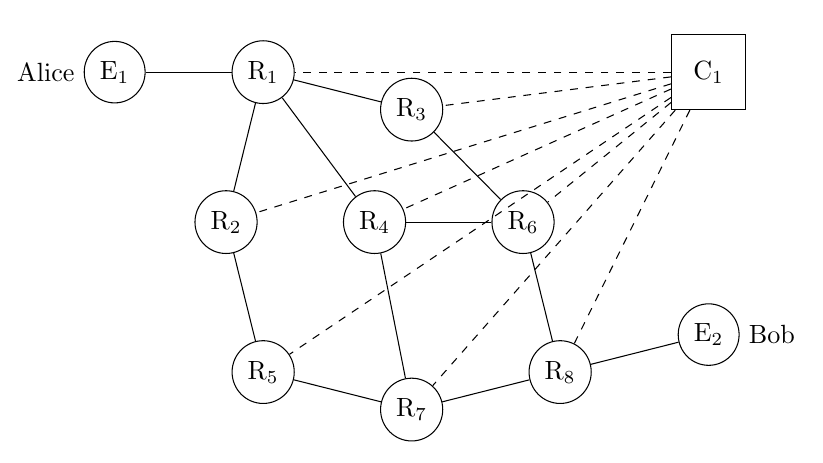

# java-openflow



My implementation of the OpenFlow protocol in Java. This program simulates OpenFlow communication between routers. It allows you to see the communication between routers and the controller's decision on how to route the packet. This is an assignment for the CSU23031 (TELECOMMUNICATIONS-II) module.

## Getting started
  ### Prerequisites
  You will need to have installed:
  1. Java
  2. Docker
  3. Linux

  ### Running Examples
  1. Clone the repo
     ```
     git clone https://github.com/lexesjan/java-openflow.git
     ```
  2. Run any of the following examples
     - start_sample_route.sh
     - start_sample_route2.sh
     - start_straight_line.sh
     
     using the following command ```bash example_name.sh```
    
  ### Documentation
  [How the program works](Lexes-Jan-Mantiquilla-OpenFlow.pdf)
